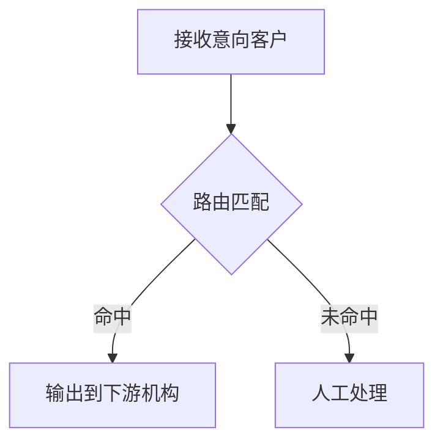

# 客户路由匹配流程

## 基本信息

| 项 | 值 |
| --- | --- |
| 图名称 | 客户路由匹配流程 |
| 所属模块 | 路由 |
| 版本号 | v1.0.0 |
| 创建人 | （待补充） |
| 依赖图 | [[流程图/进件/客户进件流程]] |
| 关联需求 | [[20260806/项目1-路由升级/需求分析]] |

## 流程图

## 步骤说明

1. 接收上游推送的意向客户
2. （待补充：路由匹配规则说明）

## 变更记录

| 版本 | 日期 | 变更说明 |
| --- | --- | --- |
| v1.0.0 | 2026-08-06 | 初版 |
