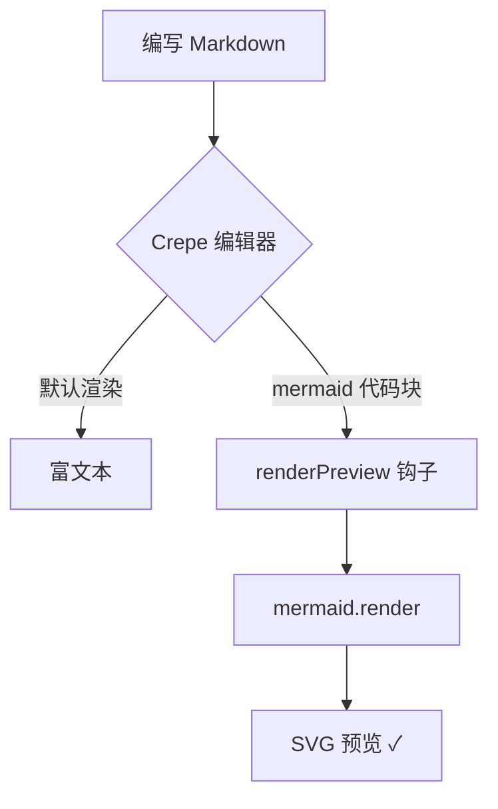
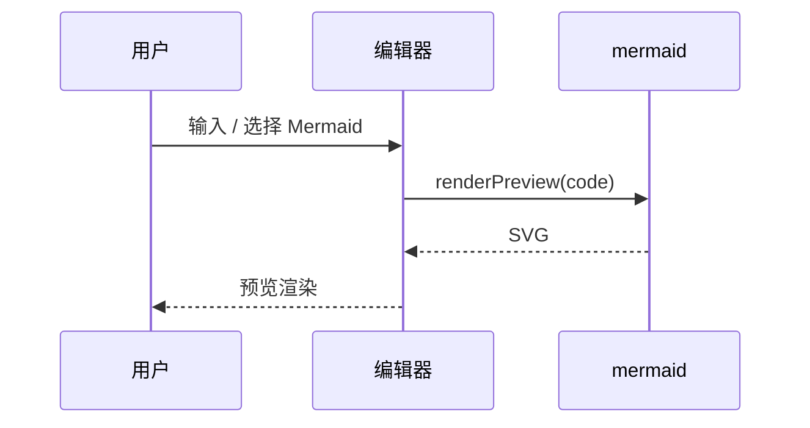

# 🥛 Milkdown × Crepe

这是一个**功能齐全**的 Markdown 编辑器 Demo，由 [Milkdown](https://milkdown.dev) 的 `@milkdown/crepe` 构建。

## 支持的语法

### 文本样式
普通文字，**加粗**，*斜体*，~~删除线~~，`行内代码`，行内公式 $E = mc^2$，以及[超链接](https://milkdown.dev)。

### 列表
- 无序列表项
- 嵌套
  - 二级项目
  - 二级项目

1. 有序列表项
2. 有序列表项

- [x] 已完成的任务
- [ ] 未完成的任务

> 这是一段引用。选中任意文字试试悬浮工具栏；在空行输入 `/` 可以唤起斜杠指令菜单。

### 表格

| 功能 | 插件/组件 | 状态 |
| --- | --- | --- |
| 代码块 | code-block (CodeMirror) | ✅ |
| 表格 | table-block + GFM | ✅ |
| 图片 | image-block | ✅ |
| 公式 | LaTeX (KaTeX) | ✅ |

### 代码块
```js
// 带语言选择器的代码块（CodeMirror 渲染）
function greet(name) {
  return `Hello, ${name}!`
}
console.log(greet('Milkdown'))
```

### 块级公式

```latex
f(x) = \int_{-\infty}^{\infty} \hat f(\xi)\,e^{2 \pi i \xi x} \,d\xi
```

### Mermaid 图表

在空行输入 `/` 会看到 **Mermaid 分组**（共 30 种图表类型），选择任意类型即可插入带示例的代码块，点击代码块右上角预览按钮（👁）渲染。



也可以画时序图：



---
试试上方工具栏：切换 **6 套主题**、**导入/导出** Markdown、**源码实时预览**、**只读模式**、**全屏**。也可以直接把图片拖进编辑器（默认转 base64）。
