# Mermaid 图表示例大全

> 全部 **30 种** Mermaid 图表类型（mermaid@11.16.1），均通过 `mermaid.parse` 语法验证。
> 点击每个代码块右上角的 **👁 预览** 按钮查看渲染效果；也可以输入 `/` 通过斜杠命令插入任意类型。

## 流程 & 结构

### 1. Flowchart 流程图

**DSL 关键字：** `graph`

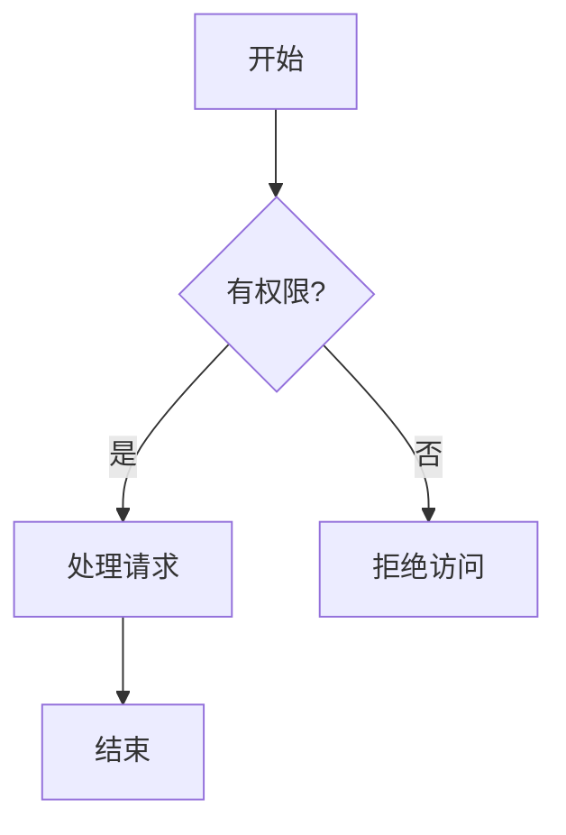
```mermaid
graph TD
  A[开始] --> B{有权限?}
  B -->|是| C[处理请求]
  B -->|否| D[拒绝访问]
  C --> E[结束]
```

### 2. Sequence 时序图

**DSL 关键字：** `sequenceDiagram`

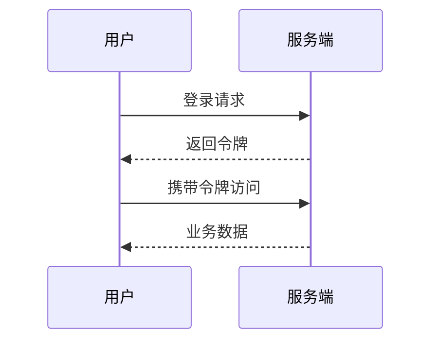
```mermaid
sequenceDiagram
  participant U as 用户
  participant S as 服务端
  U->>S: 登录请求
  S-->>U: 返回令牌
  U->>S: 携带令牌访问
  S-->>U: 业务数据
```

### 3. State 状态图

**DSL 关键字：** `stateDiagram-v2`

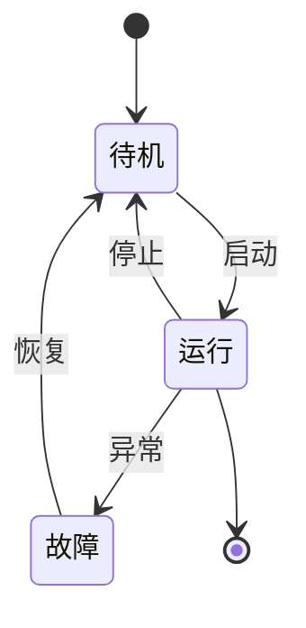
```mermaid
stateDiagram-v2
  [*] --> 待机
  待机 --> 运行: 启动
  运行 --> 待机: 停止
  运行 --> 故障: 异常
  故障 --> 待机: 恢复
  运行 --> [*]
```

### 4. Class 类图

**DSL 关键字：** `classDiagram`

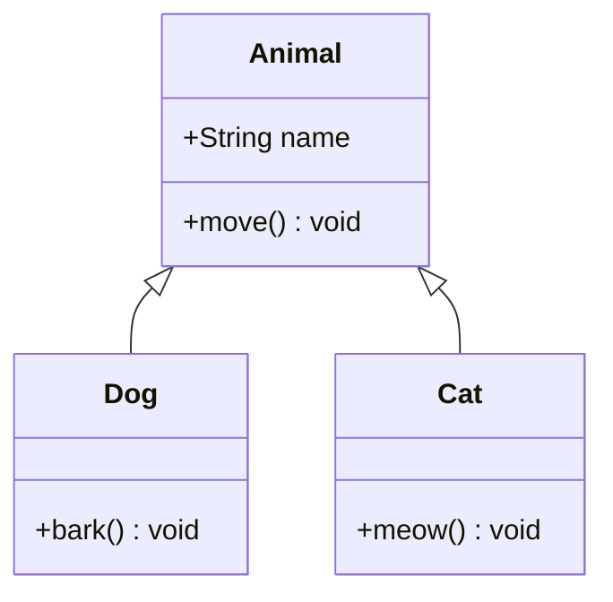
```mermaid
classDiagram
  class Animal {
    +String name
    +move() void
  }
  class Dog {
    +bark() void
  }
  class Cat {
    +meow() void
  }
  Animal <|-- Dog
  Animal <|-- Cat
```

### 5. Block 块图 β

**DSL 关键字：** `block-beta`

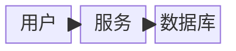
```mermaid
block-beta
  columns 3
  A["用户"] B["服务"] C["数据库"]
  A --> B
  B --> C
```

### 6. Mindmap 思维导图

**DSL 关键字：** `mindmap`

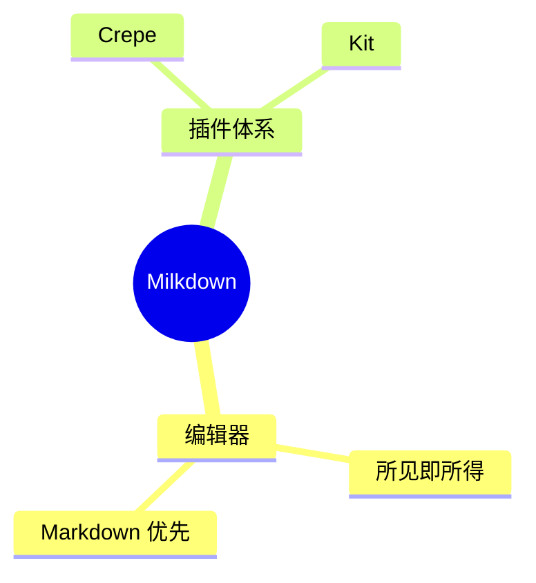
```mermaid
mindmap
  root((Milkdown))
    编辑器
      所见即所得
      Markdown 优先
    插件体系
      Crepe
      Kit
```

### 7. Timeline 时间线

**DSL 关键字：** `timeline`

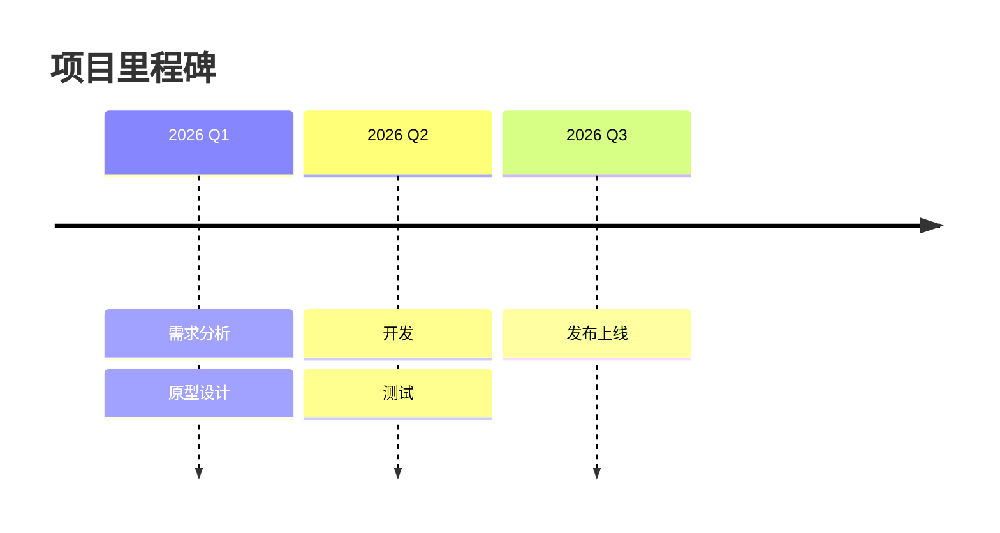
```mermaid
timeline
  title 项目里程碑
  2026 Q1: 需求分析: 原型设计
  2026 Q2: 开发: 测试
  2026 Q3: 发布上线
```

### 8. Git 分支图

**DSL 关键字：** `gitGraph`

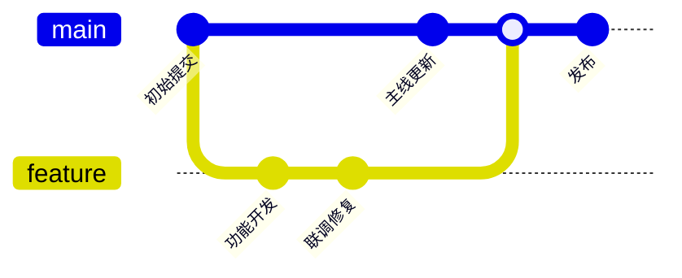
```mermaid
gitGraph
  commit id: "初始提交"
  branch feature
  checkout feature
  commit id: "功能开发"
  commit id: "联调修复"
  checkout main
  commit id: "主线更新"
  merge feature
  commit id: "发布"
```

## 建模 & 关系

### 1. ER 实体关系图

**DSL 关键字：** `erDiagram`

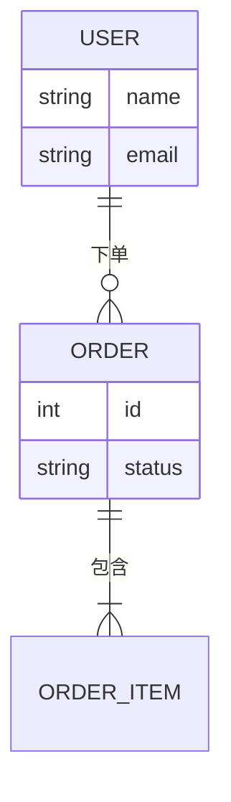
```mermaid
erDiagram
  USER ||--o{ ORDER : 下单
  ORDER ||--|{ ORDER_ITEM : 包含
  USER {
    string name
    string email
  }
  ORDER {
    int id
    string status
  }
```

### 2. C4 系统架构图

**DSL 关键字：** `C4Context`

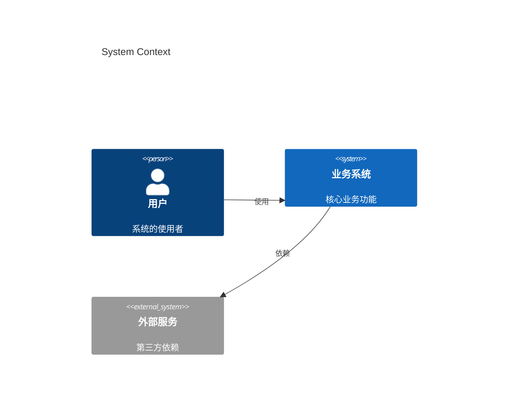
```mermaid
C4Context
  title System Context
  Person(user, "用户", "系统的使用者")
  System(biz, "业务系统", "核心业务功能")
  System_Ext(ext, "外部服务", "第三方依赖")
  Rel(user, biz, "使用")
  Rel(biz, ext, "依赖")
```

### 3. Architecture 架构图 β

**DSL 关键字：** `architecture-beta`

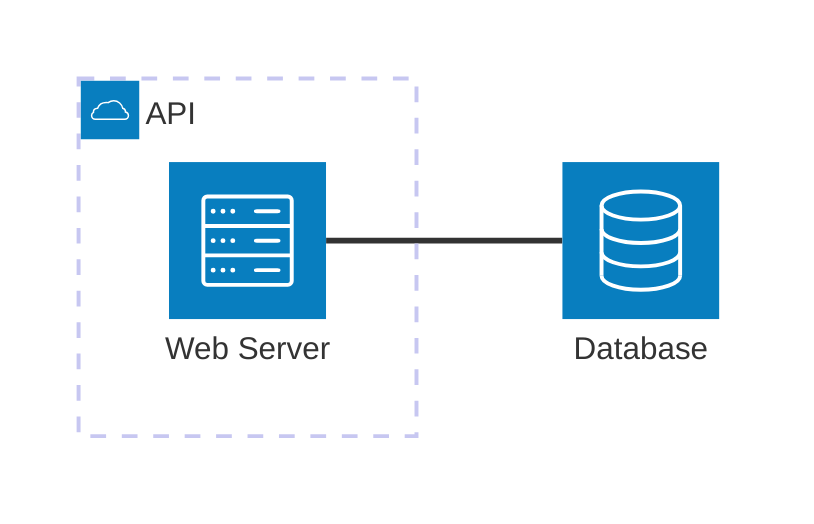
```mermaid
architecture-beta
  group api(cloud)[API]
  service web(server)[Web Server] in api
  service db(database)[Database]
  web:R -- L:db
```

### 4. Kanban 看板

**DSL 关键字：** `kanban`

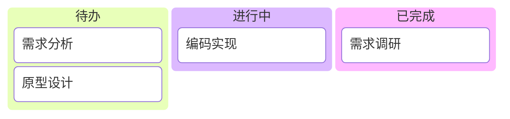
```mermaid
kanban
  Todo[待办]
    t1[需求分析]
    t2[原型设计]
  Doing[进行中]
    t3[编码实现]
  Done[已完成]
    t4[需求调研]
```

### 5. Requirement 需求图

**DSL 关键字：** `requirementDiagram`

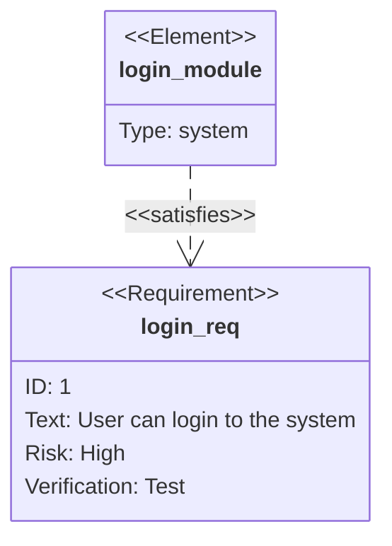
```mermaid
requirementDiagram
  requirement login_req {
    id: 1
    text: User can login to the system
    risk: high
    verifymethod: test
  }
  element login_module {
    type: system
  }
  login_module - satisfies -> login_req
```

### 6. Event Modeling 事件建模

**DSL 关键字：** `eventmodeling`

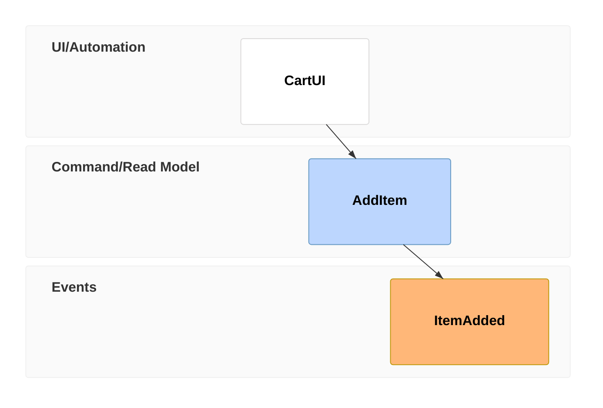
```mermaid
eventmodeling
tf 01 ui CartUI
tf 02 cmd AddItem
tf 03 evt ItemAdded
```

### 7. Cynefin 认知框架 β

**DSL 关键字：** `cynefin-beta`

```mermaid
cynefin-beta
  title 故障响应
  clear
    "重启服务"
  complicated
    "分析性能日志"
  complex
    "实验验证假设"
  chaotic
    "立即联系值班"
```

## 数据 & 统计

### 1. Pie 饼图

**DSL 关键字：** `pie`

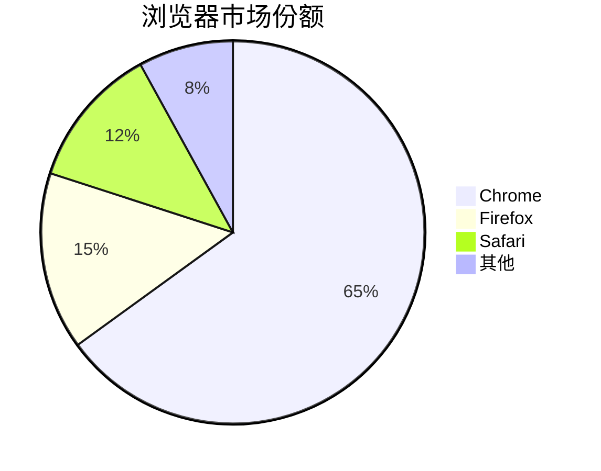
```mermaid
pie title 浏览器市场份额
  "Chrome" : 65
  "Firefox" : 15
  "Safari" : 12
  "其他" : 8
```

### 2. XY Chart 柱线图

**DSL 关键字：** `xychart`

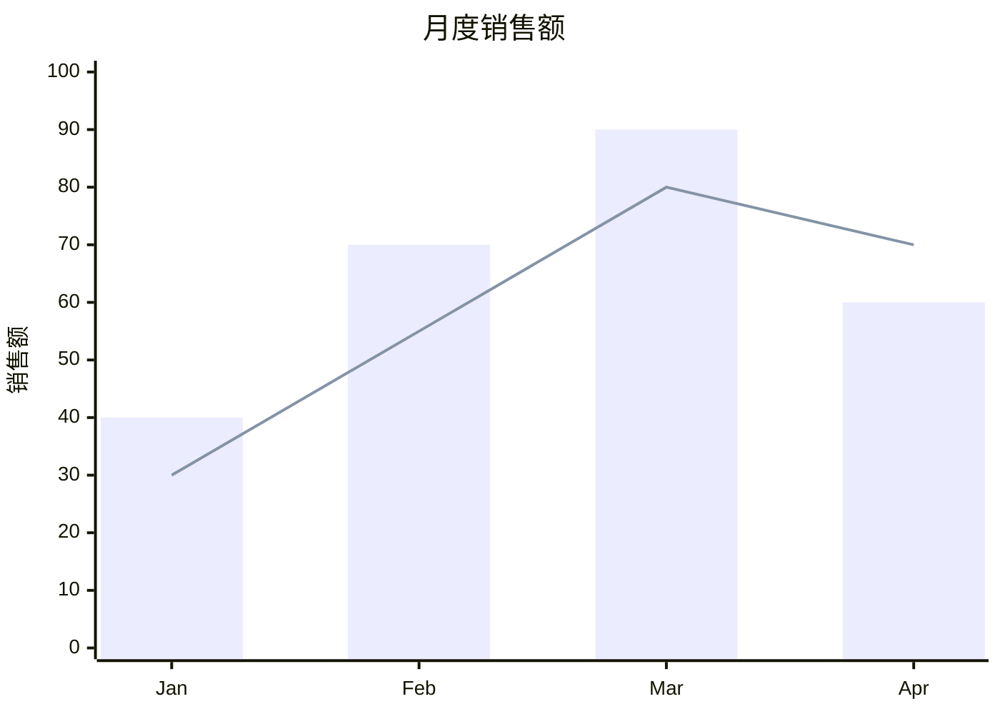
```mermaid
xychart
  title "月度销售额"
  x-axis [Jan, Feb, Mar, Apr]
  y-axis "销售额" 0 --> 100
  bar [40, 70, 90, 60]
  line [30, 55, 80, 70]
```

### 3. Quadrant 象限图

**DSL 关键字：** `quadrantChart`

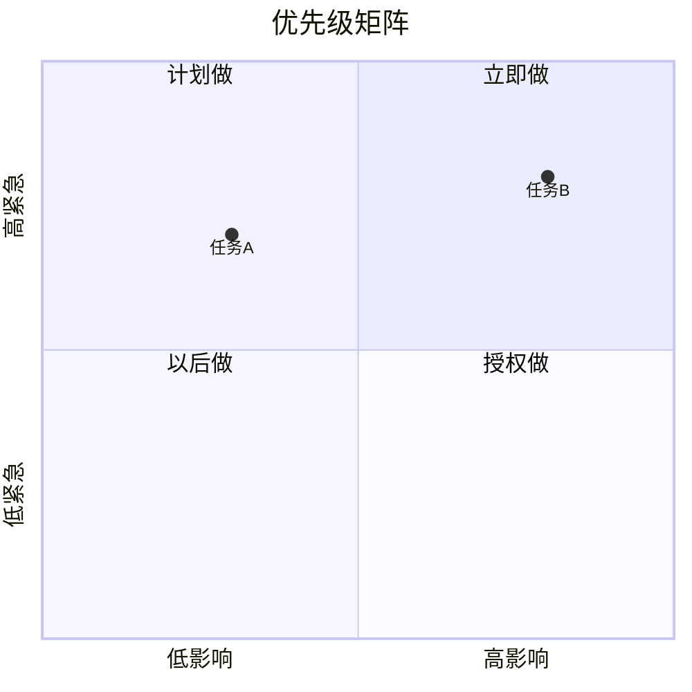
```mermaid
quadrantChart
  title 优先级矩阵
  x-axis 低影响 --> 高影响
  y-axis 低紧急 --> 高紧急
  quadrant-1 立即做
  quadrant-2 计划做
  quadrant-3 以后做
  quadrant-4 授权做
  任务A: [0.3, 0.7]
  任务B: [0.8, 0.8]
```

### 4. Sankey 桑基图 β

**DSL 关键字：** `sankey-beta`

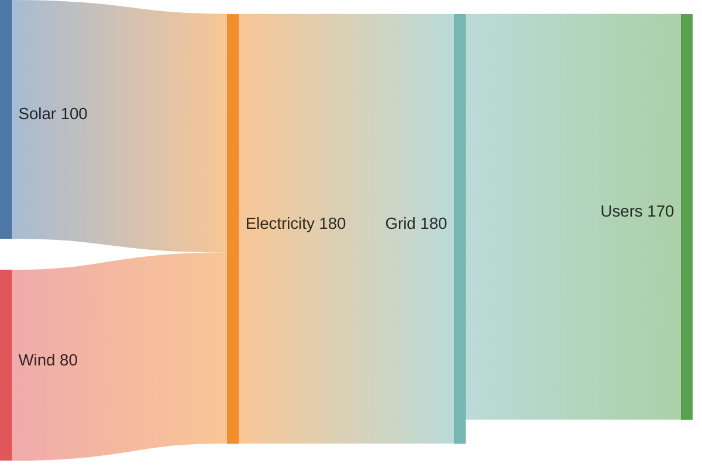
```mermaid
sankey-beta
Solar, Electricity, 100
Wind, Electricity, 80
Electricity, Grid, 180
Grid, Users, 170
```

### 5. Radar 雷达图 β

**DSL 关键字：** `radar-beta`

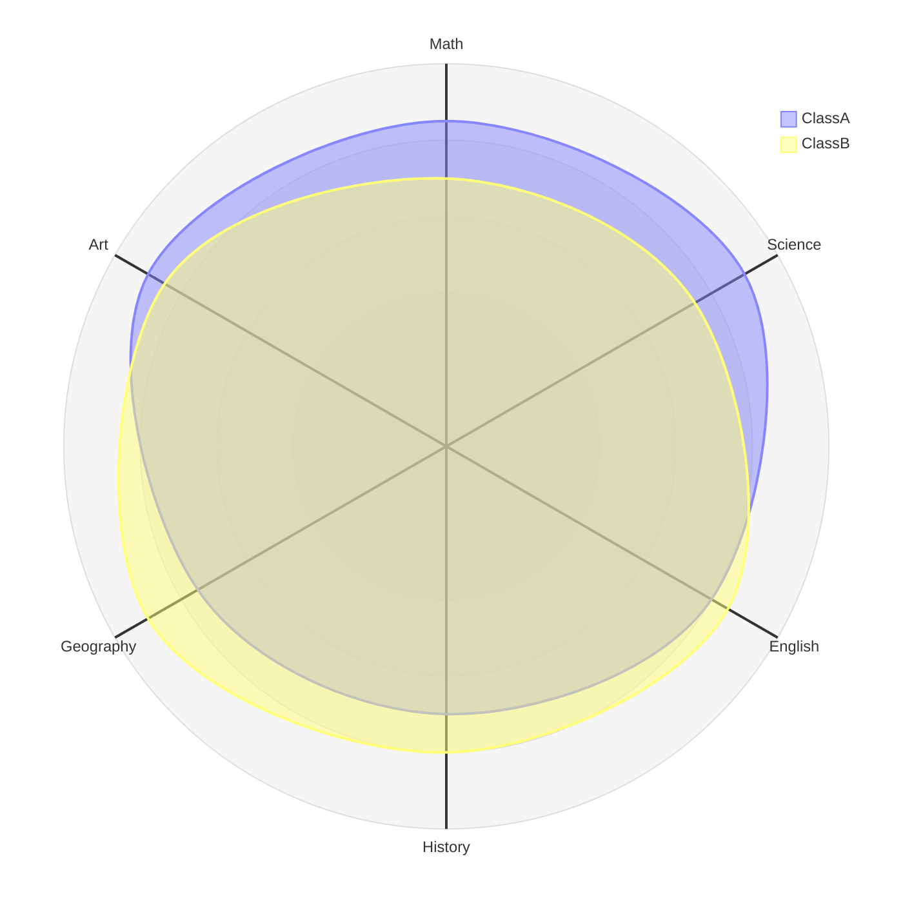
```mermaid
radar-beta
  axis math["Math"], sci["Science"], eng["English"]
  axis his["History"], geo["Geography"], art["Art"]
  curve ClassA{85, 90, 80, 70, 75, 90}
  curve ClassB{70, 75, 85, 80, 90, 85}
  max 100
  min 0
```

### 6. Venn 韦恩图 β

**DSL 关键字：** `venn-beta`

```mermaid
venn-beta
  title 技术栈交集
  set Frontend
  set Backend
  union Frontend,Backend["全栈"]
```

### 7. Treemap 矩形树图 β

**DSL 关键字：** `treemap-beta`

```mermaid
treemap-beta
"前端"
    "HTML": 30
    "CSS": 25
    "JavaScript": 45
"后端"
    "Node.js": 60
    "Go": 40
```

### 8. Info 信息图

**DSL 关键字：** `info`

```mermaid
info
```

## 管理 & 分析

### 1. Gantt 甘特图

**DSL 关键字：** `gantt`

```mermaid
gantt
  title 项目计划
  dateFormat YYYY-MM-DD
  section 需求
    需求分析: a1, 2026-01-05, 7d
  section 开发
    编码实现: after a1, 14d
  section 测试
    测试验收: after a1, 7d
```

### 2. Journey 用户旅程

**DSL 关键字：** `journey`

```mermaid
journey
  title 我的工作日
  section 上午
    起床: 5: 我
    通勤: 3: 我
    工作: 4: 我
  section 下午
    会议: 3: 我
    下班: 5: 我
```

### 3. Ishikawa 鱼骨图 β

**DSL 关键字：** `ishikawa-beta`

```mermaid
ishikawa-beta
    产品质量问题
    人员
        技能不足
        疲劳作业
    设备
        老化
        未校准
    流程
        缺少质检
        规范不清
```

### 4. Wardley 价值链 β

**DSL 关键字：** `wardley-beta`

```mermaid
wardley-beta
  title Tea Shop Value Chain
  anchor business [0.95, 0.63]
  component tea [0.79, 0.61]
  component leaf [0.63, 0.81]
  component water [0.52, 0.80]
  business -> tea
  tea -> leaf
  tea -> water
```

### 5. Tree View 目录树 β

**DSL 关键字：** `treeView-beta`

```mermaid
treeView-beta
├── src/
│   ├── main.ts
│   └── demo.md
├── index.html
└── package.json
```

### 6. Packet 数据包图 β

**DSL 关键字：** `packet-beta`

```mermaid
packet-beta
0-15: "源端口"
16-31: "目的端口"
32-63: "序号"
64-95: "确认号"
96-99: "数据偏移"
100-105: "保留"
106: "URG"
107: "ACK"
108: "PSH"
```

### 7. Railroad 铁路图 β

**DSL 关键字：** `railroad-ebnf-beta`

```mermaid
railroad-ebnf-beta
title "数字定义"
digit = "0" | "1" | "2" | "3" | "4" | "5" | "6" | "7" | "8" | "9" ;
```

---

由 `mermaid-diagrams.ts` 自动生成，如需修改示例请编辑数据源后重新生成。